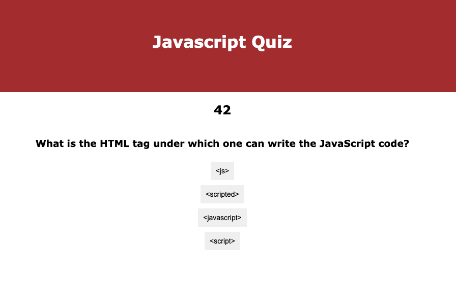

# Columbia University Bootcamp Week 4 Homework: Quiz

## Introduction
This repo is my fourth homework for my Columbia Bootcamp. I completed the following:
1. I created a quiz with 5 multiple choice questions. The question credit: https://www.geeksforgeeks.org/javascript-quiz-set-1/
2. I used addEventHandlers to check the answers when users clicks on a button
3. I used a timer so that the quiz ends when the time is over.
4. I stored all the scores with initials from a form submit to local storage.

Screenshot:

## Technology
* HTML
* CSS
* JS

## Link to Deployed Site
https://byung90.github.io/columbia-week4-homework/

## License
[MIT](https://choosealicense.com/licenses/mit/)